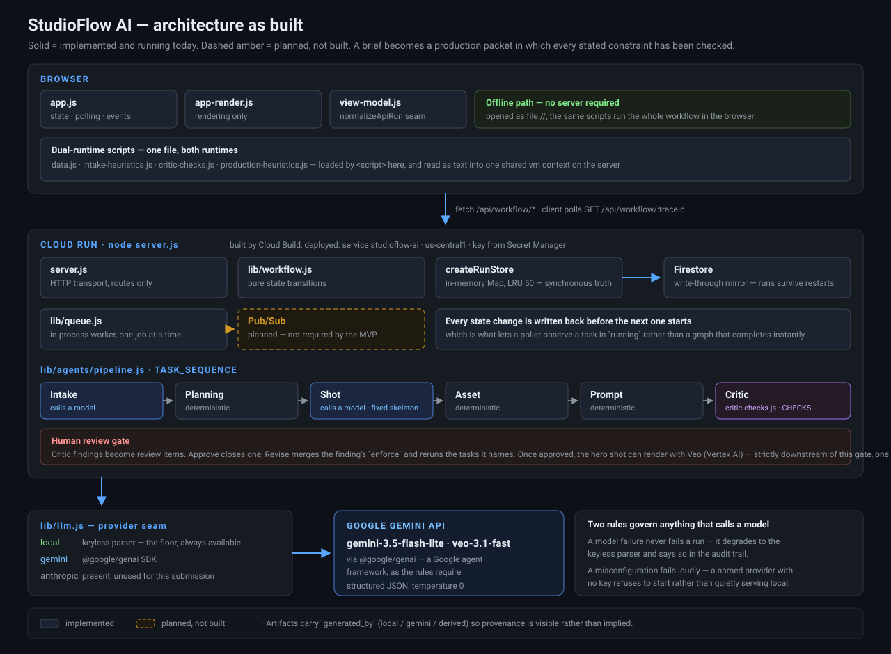

# StudioFlow AI

*Built for the All Things Agentic Hackathon — **The Collaborative Partner** track.*

**A constraint-compliance workflow for video briefs.** It turns an ambiguous brief
into a production packet where
**every stated constraint has been checked, and every failed check is traceable to the
agent that caused it and the rerun that fixed it.**

The distinction matters. A single prompt can write a shot list. What it cannot do is
notice that the brief demanded the product inside five seconds, find that the reveal
landed at 0:13, route that to the two agents responsible, rerun them with the
constraint enforced, and leave an audit trail proving it happened. That loop is the
product.

**Implementation status:** every artifact in a run is generated from the submitted
brief. The Intake Agent structures the brief, the Planning, Shot, Asset, and Prompt
Agents derive the plan, shot list, asset manifest, and prompt pack from it, and the
Critic Agent checks the result against the stated constraints. Findings are derived,
so their number varies by brief and a brief that satisfies its own constraints
produces none. Requesting a revision reruns the affected agents with the reviewer's
constraint enforced, so the artifact content changes rather than only its version
number.

**Be clear-eyed about the creative quality.** The generated prose is templated — the
shot list reads as structure, not as writing, and it will until a model is wired into
the production agents. The constraint checking, routing, rerun, and audit trail are
the parts that work today and the parts worth judging.

Execution is asynchronous: `POST /api/workflow/run` returns `202` with a queued run,
a worker executes the agents one task at a time, and the client polls to watch the
task graph advance.

What is still missing: only the Intake Agent can call a model — the rest are
deterministic generators. The queue is in-process rather than Pub/Sub, and nothing
persists across a restart. The Google Cloud services described below are the target
architecture, not yet wired up; the API surface is frozen so they can be swapped in
behind the same routes. See [docs/DEPLOYMENT.md](docs/DEPLOYMENT.md).

Every artifact carries `generated_by` so its provenance is visible rather than
implied.

## Architecture



The diagram draws the system **as built**, not the target architecture. Firestore and
Pub/Sub are dashed and labelled planned because neither is wired up — drawing them
solid would be a false claim. Also worth reading off it: only the Intake Agent calls a
model, the run store is an in-memory `Map` that is lost on restart, and the same
browser scripts run the entire workflow offline from `file://`.

## Intake Agent

The Intake Agent converts a rough brief into the structured brief defined in
[docs/AGENT_CONTRACTS.md](docs/AGENT_CONTRACTS.md), and raises clarifying questions
only for missing information that would block planning. Model output is validated
against the contract before it is allowed to become an artifact.

### The clarification loop, with real numbers

Give it a brief that is missing almost everything — `A launch film for a canned coffee
brand.` — and it does not guess quietly. It asks three questions, each carrying which
field the answer fills and why it blocks planning, and the Critic reports that it
proceeded on an assumption:

```text
3 open questions   audience: not stated   platform: not stated   duration: null
findings: assumed-duration, undefined-style, open-questions
first shot: 0:00-0:04     (a 30-second default nobody asked for)
```

Answer them — `late-shift nurses`, `TikTok`, `15 seconds` — and the answers are folded
back in as labelled brief lines, so intake reads them exactly the way it read the
original prose. The whole workflow reruns, because everything downstream of intake
depends on it:

```text
0 open questions   audience: late-shift nurses   platform: TikTok   duration: 15
findings: undefined-style
first shot: 0:00-0:02     (re-timed for the real runtime)
```

Three things worth noticing. The findings went from three to one. The one that survived
is `undefined-style` — the question nobody answered, still honestly reported. And the
shot list **re-timed itself**: the answers did not just fill fields in a form, they
changed the artifact.

The model is chosen by environment, and the workflow runs with no configuration at
all:

| `STUDIOFLOW_LLM` | Requires | Notes |
| --- | --- | --- |
| `local` (default) | nothing | Keyless parser in `intake-heuristics.js`. Also the offline path when the page is opened as a file. |
| `gemini` | `GEMINI_API_KEY` | `GEMINI_MODEL` overrides the default model. The hackathon target. |
| `anthropic` | `ANTHROPIC_API_KEY` | `ANTHROPIC_MODEL` overrides the default model. For comparison only — the Google track expects Gemini. |

With no variables set, the first available key wins, and `local` is the floor.

```bash
GEMINI_API_KEY=... npm start
```

`GET /api/health` reports which provider is actually live:

```json
{ "ok": true, "intake_provider": "local", "intake_model": null }
```

Two failure rules matter:

- **A model failure never fails a run.** Network errors, malformed JSON, and schema
  violations all degrade to the keyless parser. The run still completes and the
  audit trail records the fallback and its reason.
- **A misconfiguration fails loudly.** Asking for a provider whose key is missing
  (`STUDIOFLOW_LLM=gemini` with no `GEMINI_API_KEY`) refuses to start rather than
  silently downgrading.

The hosted adapters were written without an API key available, so they have never
reached a live endpoint. They *are* exercised against a local stub server in
`tests/async.test.js`, which covers request construction, response parsing, fenced
JSON, HTTP errors, non-JSON replies, and timeout aborts. What remains unverified is
authentication and real model behaviour — point `GEMINI_BASE_URL` /
`ANTHROPIC_BASE_URL` elsewhere to test against your own stub.

**Not yet done:** no Gemini key and no Cloud Run deployment — the two things the
track actually requires. Both are blocked on account access rather than code. See
[TODO.md](TODO.md).

## Current Docs

- [All Things Agentic Plan](docs/ALL_THINGS_AGENTIC_PLAN.md) - product,
  workflow, architecture, demo, and submission plan for StudioFlow AI.
- [Data Model](docs/DATA_MODEL.md) - MVP object shapes for the prototype,
  API, and Firestore implementation.
- [Agent Contracts](docs/AGENT_CONTRACTS.md) - JSON boundaries and prompt
  intent for each specialist agent.
- [Deployment Notes](docs/DEPLOYMENT.md) - local service and Cloud Run
  deployment path.
- [Demo Script](docs/DEMO_SCRIPT.md) - the four-minute demo, rehearsal sheet and
  failure plan.

An earlier design doc for a different, abandoned concept was removed from this
repository. It described an attention-driven editing timeline on ClickHouse and had
nothing to do with this codebase.

## Current Prototype

Open [index.html](index.html) in a browser to try the static StudioFlow AI MVP.

For the API-backed local prototype, run:

```bash
npm start
```

Then open:

```text
http://localhost:4173
```

Demo flow:

1. Click `Run Workflow`.
2. Watch the task graph move through the agent workflow. Served through the API the
   run comes back complete and lands straight on the review queue; opened as a
   static file it animates task by task.
3. Open review findings when the Critic Agent pauses the run.
4. Request revisions or approve findings.
5. Review the generated production packet and cloud proof view.

Each review finding declares which tasks it affects and, where it can, the constraint
that fixes it. Requesting a revision reruns exactly those agents with that constraint
enforced: their artifacts advance to the next version (`Shot List v1` → `Shot List
v2`) **with different content**, record why they were rerun, and add an
`artifact_created` entry to the audit trail. Approving closes the finding without
touching artifacts. When the last finding closes, the run flips to `approved` and the
production packet is regenerated.

The clearest thing to demo: give the brief a constraint like `show the product in the
first 5 seconds`. The Shot Agent lays out a standard narrative structure that opens
on atmosphere, the Critic Agent notices the subject only appears at 0:13, and the
revision moves the reveal to 0:00. The first pass is genuinely able to be wrong,
which is what makes the review gate worth having.

## What the Critic Actually Checks

Each check reads the generated artifacts against the structured brief. None of them
fire unless the brief gives them something to check, and a compliant brief produces
an empty review queue.

| Finding | Fires when |
| --- | --- |
| Subject appears too late | The brief names a window (`first 5 seconds`) and the subject reveal starts after it |
| No explicit call to action | The brief asks for a CTA and the closing beat is a generic close |
| Prohibition missing from the prompt pack | The brief forbids something the prompt pack failed to encode as a negative prompt, so nothing would stop a generator producing it |
| Required element missing from the shot list | The brief requires something no shot depicts |
| Aspect ratio conflicts with the platform | The brief asks for a frame the platform contradicts |
| Shots run long / Cuts are very fast | Runtime divided by shot count falls outside a readable range |
| Runtime was assumed | The brief states no duration, so a default was used |
| Visual direction undefined | No style was stated, so prompts fell back to neutral |
| Intake questions still open | Intake raised questions nobody answered |
| Forbidden element appears in the production output | The brief forbids something a shot description or a positive prompt actively asks for — the mirror of the check above, and the worse failure, because no negative prompt can save a shot that requests the thing itself |
| Constraint contradicts the subject | The brief forbids the film's own subject. A contradiction in the brief, not a shot-list defect, so it is raised once for a human rather than once per shot |
| Shot timings leave a gap / overlap | Consecutive shots do not meet at the seam |
| Shot list does not fill the runtime | The shots stop short of the planned duration |
| Asset group is not used by any shot | The manifest lists something no shot calls for, so it would be sourced for nothing |
| Asset points at a shot that does not exist | The manifest is out of date with the shot list |

Findings that can be fixed mechanically carry an `enforce` flag; requesting a revision
replays it through the agents. The rest are reported for a human to judge.

The checks live in [critic-checks.js](critic-checks.js) as a `CHECKS` array and run in
array order, which is the order the review queue reads in. Adding one costs an entry.

Two of these deserve a note, because they are the ones that catch defects the system
can introduce in itself rather than defects in the brief. The timing checks are quiet
on today's generated output — `allocate` produces contiguous whole seconds by
construction — and exist for when a model writes the shot list, where a plausible gap
is invisible to a schema check that only ever sees one shot at a time. The asset checks
are not hypothetical at all: on a short runtime the beat template drops beats, and a
3-second brief reports two asset groups bound to shots that no longer exist.

Useful local endpoints:

```text
GET  /api/health
GET  /api/demo
POST /api/workflow/run                         -> 202, run is queued
GET  /api/workflow/:traceId                    -> poll while the worker runs
POST /api/workflow/:traceId/clarifications     -> 202, reruns with answers
POST /api/workflow/:traceId/reviews/:reviewId
```

`POST /run` returns immediately with every task `queued`. The worker moves each task
`queued` → `running` → `completed`, appending its artifact and audit line as it goes,
so polling shows the graph advancing. A run settles on `needs_review`, `approved`, or
`failed`.

`STUDIOFLOW_STEP_DELAY_MS` (default `450`) paces the worker. The agents finish in
single-digit milliseconds, so without it a poller would only ever see the final
state. It is display pacing, not simulated work — set it to `0` and the run still
completes correctly, just too fast to watch.

Answering the Intake Agent's clarifying questions folds them back into the brief as
labelled lines (`Audience: urban gardeners`) and reruns the whole workflow, because
everything downstream of intake depends on it.

The app still works as a direct static file. When served through `npm start`,
it prefers the local API and falls back to in-browser simulation if the API is
unavailable. The fallback is announced in the audit trail along with the reason,
so a broken API path shows up as a message rather than as silently different
behavior.

## Setup, Step by Step

Node 20 or newer. Nothing else is required to see the whole workflow run.

```bash
git clone <this repository>
cd agentic-cinema
npm install          # one dependency: @google/genai
npm start            # http://localhost:4173
```

That runs the keyless path — `/api/health` will report `"intake_provider": "local"`.
Everything in this README works at that point except a real model call.

**To run the Intake Agent on Gemini**, get a key from
[Google AI Studio](https://aistudio.google.com/apikey) (free tier, no billing account
required — create the key on a project with no billing attached and it cannot charge
you). Then confirm which models that key can actually reach before using one:

```bash
GEMINI_API_KEY=... npm run models     # lists models supporting generateContent
GEMINI_API_KEY=... npm start
```

Verify it took effect — this is the check that matters, because a key that is not
picked up silently falls back to the keyless parser rather than failing:

```bash
curl localhost:4173/api/health        # "intake_provider" must say "gemini"
```

Override the model if the default has moved on: `GEMINI_MODEL=<id> npm start`.

## Deploy to Cloud Run, Step by Step

Requires a Google Cloud project **with billing enabled** — Cloud Run has a free tier
but will not turn on without a billing account. This is separate from the Gemini key
above, which needs no billing at all.

```bash
# 1. install and authenticate
winget install Google.CloudSDK          # or the installer for your platform
gcloud auth login                       # opens a browser
gcloud config set project PROJECT_ID

# 2. enable the services
gcloud services enable run.googleapis.com cloudbuild.googleapis.com \
  secretmanager.googleapis.com

# 3. store the key rather than passing it as plain config
printf '%s' "$GEMINI_API_KEY" | gcloud secrets create gemini-api-key --data-file=-

# 4. build in the cloud — Docker is NOT required locally
gcloud builds submit --tag gcr.io/PROJECT_ID/studioflow-ai

# 5. deploy
gcloud run deploy studioflow-ai \
  --image gcr.io/PROJECT_ID/studioflow-ai \
  --region us-central1 \
  --allow-unauthenticated \
  --max-instances=1 \
  --set-secrets GEMINI_API_KEY=gemini-api-key:latest
```

Two flags deserve an explanation rather than a copy-paste.

`--max-instances=1` is **required for correctness today**, not for cost. The run store
is an in-memory `Map` and the client polls: with several instances, `POST /run` lands
on one and the next poll hits another, which returns 404. Firestore
([TODO.md](TODO.md) item 4) is what removes this constraint.

`--min-instances=1` would also be needed to survive scale-to-zero, since a cold start
wipes every in-flight run — but **it bills for an always-allocated container**, so it
is deliberately left out above. Set it only for the window in which you are recording
the demo or being judged, and set it back to `0` afterwards:

```bash
gcloud run services update studioflow-ai --region us-central1 --min-instances=1
gcloud run services update studioflow-ai --region us-central1 --min-instances=0
```

Set a budget alert before any of this. Note what it does and does not do: it emails
you, it does not stop spending. The only hard stop is detaching the billing account.

## Repository Layout

```text
index.html                app shell and the four views
styles.css                styling
data.js                   labels and the default brief — no generated content
intake-heuristics.js      keyless brief parser, output validation, formatting
critic-checks.js          the Critic's checks, one entry per constraint class
production-heuristics.js  plan, shot list, assets, prompts, packet — no checks
view-model.js             pure view helpers shared by the browser and the tests
app-render.js             rendering only: reads state, writes into the DOM
app.js                    state, API calls, orchestration, events
server.js                 HTTP server: static files and JSON API
lib/workflow.js           run lifecycle, task execution, review handling, store
lib/queue.js              in-process job queue (the Pub/Sub seam)
lib/llm.js                model provider seam: local, Gemini, Anthropic adapters
lib/agents/intake.js      Intake Agent: prompt, schema validation, degradation
lib/agents/pipeline.js    runTask: the single place an artifact is generated
tests/                    workflow, intake, production, and async suites
docs/                     plan, data model, agent contracts, deployment notes
```

`runTask` in `lib/agents/pipeline.js` is the only place an artifact is generated. The
worker calls it to execute a run and a revision calls it again to rerun affected
agents. Adding a second generation path is how the two silently drift apart.

`data.js`, `intake-heuristics.js`, `critic-checks.js`, `production-heuristics.js`, and
`view-model.js` are plain browser scripts loaded through `<script>` tags, and Node
evaluates the same files in a sandbox to reuse them server-side and in tests. They must
stay free of `require`, `module.exports`, `import`, and `export`. This is what lets the
offline path run the same agents as the server rather than a second implementation of
them.

`critic-checks.js` and `production-heuristics.js` are loaded into **one shared sandbox**
so the second can call `STUDIOFLOW_CRITIC` in the first, exactly the way two `<script>`
tags share `window`.

Adding a top-level source file means registering it in three places: the `check`
script in `package.json`, the `COPY` list in the `Dockerfile`, and, for browser
scripts, the `<script>` tags in `index.html`.

## Local Server Behavior

- Workflow runs are kept in memory keyed by `trace_id`, capped at 50 runs with
  least-recently-used eviction. Restarting the server drops all runs.
- `data.js` is cached against its own contents rather than its timestamp, so
  editing the demo scenario takes effect without restarting the server.
- `PORT` overrides the default `4173`. The `Dockerfile` sets `8080` for Cloud Run.

Validation:

```bash
npm run check
npm test
```

`npm run check` is a syntax pass over every source file. `npm test` runs four
plain-`assert` suites — no framework, no coverage tooling:

| Suite | Covers |
| --- | --- |
| `tests/workflow.test.js` | run creation, the revision loop and artifact versioning, run-store eviction, the script cache, HTML escaping, API response normalization, and the three hardcoded file lists |
| `tests/intake.test.js` | brief parsing, contract validation, degradation to the keyless parser |
| `tests/production.test.js` | every generator, and each Critic check both firing and staying silent |
| `tests/async.test.js` | the queue, observable task states, and the hosted adapters against a stub endpoint |

Every suite drives the live path. To check a suite is really guarding something,
break the code it covers on purpose and confirm it goes red — the Critic checks were
verified that way, one deliberate breakage at a time.

## StudioFlow AI Summary

StudioFlow AI is designed for advertising agencies, brand studios, AI video
studios, and pre-production teams. It demonstrates an agentic workflow rather
than a single-turn generator:

- intake and clarification of a creative brief
- task graph planning
- asynchronous specialist agents
- structured artifacts
- critic review
- human approval
- audit logging
- Google Cloud deployment proof

## Hackathon Strategy

Track: **The Collaborative Partner** — "an agent that leads the way and takes notes…
asks clarifying questions, guides the user step-by-step, and has a clear way to capture
feedback, so it constantly adapts to the user's unique way of thinking."

That is a description of this system rather than an aspiration for it, and each clause
maps to something you can run:

| The track asks for | Where it is |
| --- | --- |
| Ingesting messy, unstructured input | A paragraph of prose becomes a structured brief with typed fields |
| Asking clarifying questions | Intake raises them **only** for information that would block planning, each carrying `fills` (which field an answer belongs to) and `why_it_matters` |
| Guiding the user step by step | The task graph, then a review queue of findings that each name the agents responsible |
| A clear way to capture feedback | Approve or revise, per finding |
| **Adapting to the user** | Corrections accumulate in `run.enforce` and every later rerun carries them. The adaptation is state, not a claim |
| Synthesising rather than reading | Six artifacts generated from the brief, re-versioned with different content when a correction lands |

The system was not reframed to fit the track. The human review gate has been the
product since the first commit — the loop is what a single prompt cannot do.

Technical posture, and where each part actually stands:

| | Status |
| --- | --- |
| Gemini 3.5 or later | `gemini-3.6-flash` is the default and the code path is live — but no real call has been made yet, so treat it as unproven until `/api/health` reports `gemini` |
| Google ADK or GenAI SDK | **Done** — `@google/genai` is in the runtime path, in `lib/llm.js` |
| Cloud Run | Not deployed. Dockerfile and the steps above are ready |
| Firestore | Not wired up. The store interface was kept narrow for it |
| Pub/Sub or Cloud Tasks | Not wired up. `lib/queue.js` is the seam |
| Cloud Storage | Not used |
| Cloud Logging | `trace_id` is on every task, artifact and audit event, so the correlation works with no code change once deployed |

The project should be judged as a workflow execution system: the agent takes
responsibility for moving creative production forward, while keeping humans in
control at important review points.

## Near-Term Backend Path

The server has exactly one runtime dependency — `@google/genai`, used by the Gemini
adapter — and nothing else, so the prototype still runs anywhere. The Cloud Run version
should preserve the same API shape while swapping local seed data for Google Cloud
services:

- `/api/demo` reads project seed data from Firestore.
- `/api/workflow/run` creates a workflow run, stores tasks, and dispatches jobs
  through Pub/Sub or Cloud Tasks.
- Worker endpoints call Gemini through Google ADK or the GenAI SDK.
- Generated artifacts are written to Cloud Storage.
- Audit events include Cloud Logging trace IDs.
